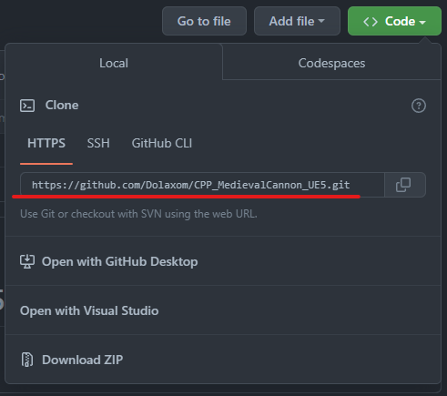
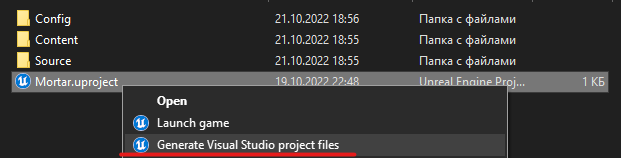
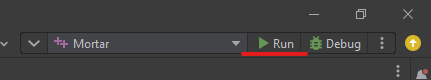
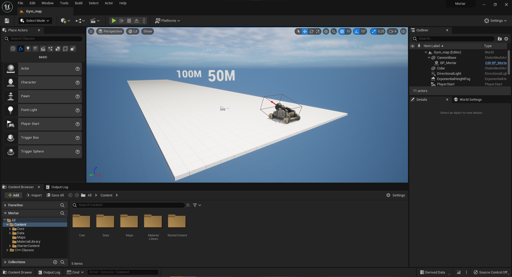

# The implementation of a medieval mortar on the Unreal Engine using C ++

https://user-images.githubusercontent.com/51160711/197254637-776b2cdb-5800-45af-89d3-add0214635d2.mp4

--- 

## How to use:

### Step 1:
#### Clone this repository.

### Step 2:
#### Generate VS project files. Right click on CPP_MedievalCannon_UE5\ue5\Mortar\Mortar.uproject and select the desired item.
##### **Note:** You must have Visual Studio 2019 or higher installed! And also UE4/5 (There may be problems with version 4 of the engine)

### Step 3:
#### Open the appeared .sln file through an IDE convenient for you and build the project.

### Step 4:
#### The project is launched and you can migrate the assets you need from there for your games!

---

## Project structure
The files we need are in the path **CPP_MedievalCannon_UE5\ue5\Mortar**

Let's deal with the **Content/** folder first:
- The **Content/Core/** folder contains all the main elements of the game prototype. Created blueprints based on the classes that will be discussed, as well as the model of the gun itself. In the **Content/Data/** existing Sounds folder. The rest of the folders speak for themselves thanks to the name.

The **Source/** folder contains my C ++ classes with the implementation of game mechanics. Immediately go to the subfolder **Source/Mortar/**:
- The **Cannon/** folder contains the classes for the cannon itself and the cannonball class. In the Characters folder there are character classes *(there are two of them, because in the future I will probably develop this project and I need a separate player subclass)*. As well as the **AnimInstance** and **controller** classes in their respective folders.

## How does it work:
**Attention! At the moment the project is not finished yet**
- Implemented a shot
- Implemented control of vertical and perpendicular velocities, as well as control over the initial force of the shot
- Cannon swivel up and down
- Turn left and right not implemented

### class MortarCannon:
- In the body of the class **AMortarCannon()**, components such as: root, flowed mortars, an arrow for tests, a trigger box for detecting a player and table events are created. Also tick component = true.

- In **BeginPlay()**, there is a casting to find a player in the world:

`Player = Cast<APlayerCharacter>(UGameplayStatics::GetPlayerCharacter(GetWorld(), 0));`

- **OnOverlapBegin()**, a comparison is made of who crossed the trigger box with the character we are casting:

`if (Player == OtherActor)`

If the comparison returned true, then we cast the found cannon in our character and set the value that the player is nearby to true.
In **OnOverlapEnd()**, almost the same thing happens, but false is set.

- In **Shoot()**, we check if we have a cannonball exposed, and if so, we will spawn it. We also set sounds and effects, if any.
